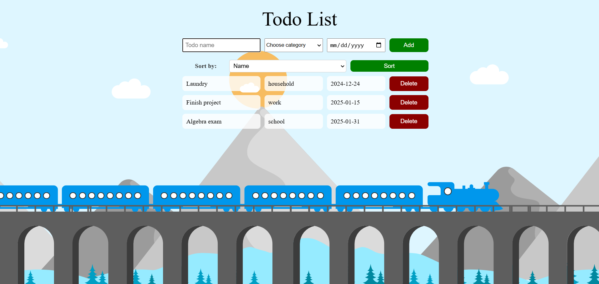

## To-doList.v2
Simple To-Do List application allows users to add, delete and sort tasks. Everyt task has following attributes: name, category, due date. It features background animation and on-click animation when adding a new task to enhance user experience.
## Preview

